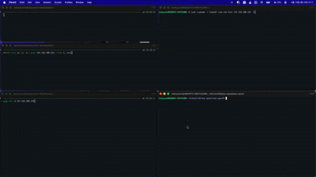

## Demo

mp4는 미리보기가 안되어 gif로 첨부합니다.

[원본 영상 mp4](/arp-spoof.mp4)

## 구현 기능

- Sender에게 거짓 ARP Reply를 보내서 ARP 테이블을 오염시킨다.
- Sender가 보낸 spoofed IP 패킷을 감지하여 Target에게 relay한다.
- ARP 패킷을 감시하여 recover 감지 시 즉시 재감염시킨다.
- 별도 스레드에서 10초마다 주기적으로 infect 패킷을 전송한다.
- Ctrl+C 종료 시 정상 ARP 정보를 sender에게 전송하여 감염을 해제한다.
- snaplen을 65535로 설정하여 jumbo frame도 relay할 수 있다.
